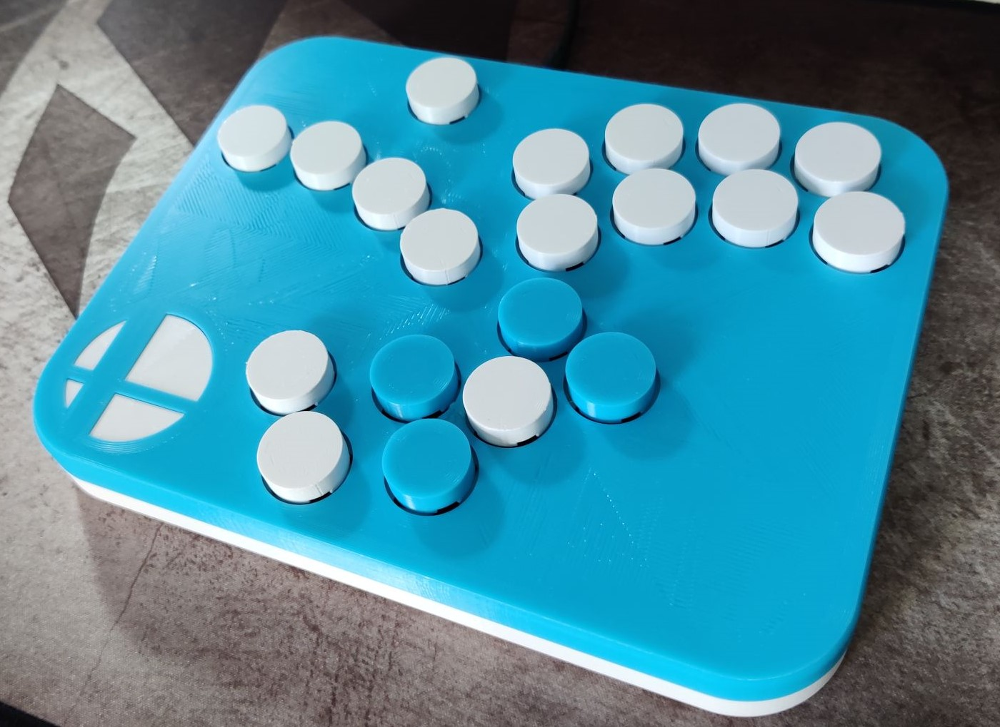
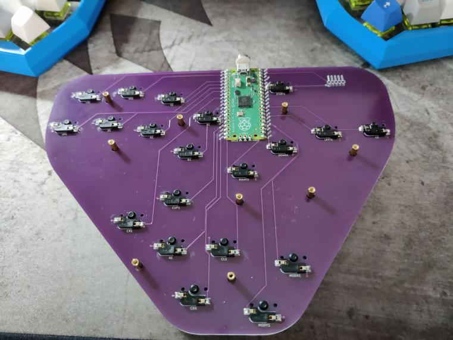

# Sq0xx

Squat b0xx.

I've printed and tested V1, there are some fixes in the V2 case files that are untested but should work just fine.

## V1 vs V2
I made a few small changes to the way that the two halves connect.

* Increased the size of the inset to make a tighter fit.
* Moved the magnets closer together.

## 3D Printed parts
* 1 x Top.stl
* 1 x Plate.stl
* 1 x TopLogo.stl
* 1 x Bottom.stl
* 20 x [20mm MX button](https://cdn.thingiverse.com/assets/29/e4/cd/0b/65/20.64mm_Keycap.stl) from the [Fake1](https://www.thingiverse.com/thing:4917086)

## BOM
* PCB, I suggest JLCPCB.
* 20 MX keyboard switches.
* 20 Kailh hot swap sockets.
* Raspberry Pico micro controller.
* M2 Standoffs [Amazon link](https://www.amazon.co.uk/gp/product/B08LDF5SMQ)
* 4 10mm x 3mm magnets [Amazon link](https://www.amazon.co.uk/gp/product/B07QKWBS4S)

## Soldering
All of the components are soldered on to the back of the PCB. The Pico is soldered flat against the board without a socket. I have added break outs for a hardwired GCC cable if required.

## Firmware
Big shout out to Arte for writing some awesome software, [pico-rectangle](https://github.com/JulienBernard3383279/pico-rectangle)